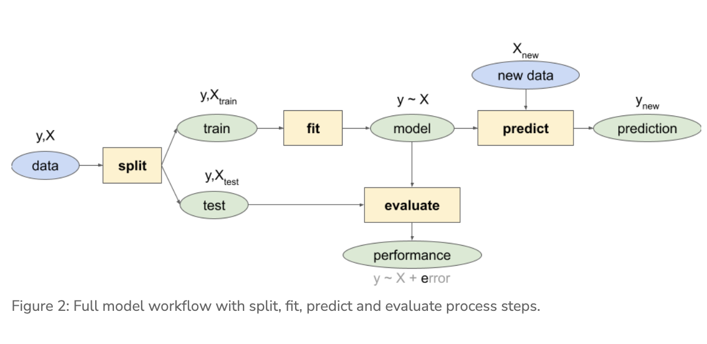
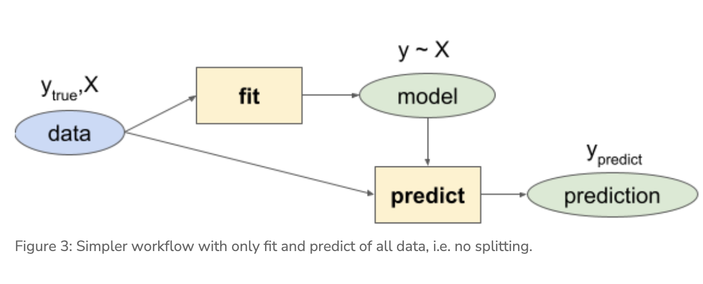
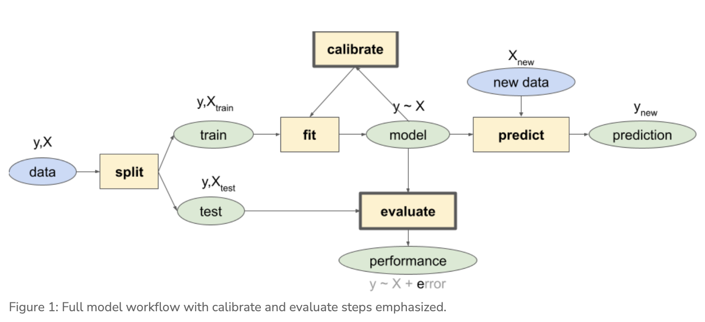

```{r setup, include=FALSE}
knitr::opts_chunk$set(echo = TRUE, warning = FALSE, message = FALSE)

```

## Lab 1a. Species Distribution Modeling - Exploratory Data Analysis

### Learning Objectives

#### Explore 

- Fetch species observations from the Global Biodiversity Information Facility (GBIF.org) using an R package that wraps a function around their API.
- Fetch environmental data for defining environmental relationship in the species distribution model (SDM).
- Generate pseudo-absences, or background, points with which to differentiate from the species presence points in the SDM.
- Extract underlying environmental data from points.
- Plot term plots of each environmental predictor with the species response.

### 1 Overview

This lab will introduce you to machine learning by predicting presence of a species of you choosing from observations and environmental data. We will largely follow guidance found at Species distribution modeling | R Spatial using slightly newer R packages and functions.

### 2 Explore

This first part of the lab involves fetching data for your species of interest, whether terrestrial or marine.

### Section 2.1 Install Packages

```{r}
# load packages, installing if missing
if (!require(librarian)){
  install.packages("librarian")
  library(librarian)
}
librarian::shelf(
  dismo, dplyr, DT, ggplot2, here, htmltools, leaflet, mapview, purrr, raster, readr, rgbif, rgdal, rJava, sdmpredictors, sf, spocc, tidyr)
select <- dplyr::select # overwrite raster::select
options(readr.show_col_types = FALSE)

# set random seed for reproducibility
set.seed(42)

# directory to store data
dir_data <- here("ferret_data/sdm")
dir.create(dir_data, showWarnings = F, recursive = TRUE)
```

### Section 2.2 Choose a Species


For my species distribution model, I will analyze the black-footed ferret, *Mustela nigripes*, which is an endangered mammal species that typically inhabits grasslands in the Northern Great Plains of the U.S. Black-footed ferrets are one of the most endangered mammals in North America and are the only ferret species native to the continent. The main sources of their population decline include habitat loss and disease. Therefore, it is exceptionally important that we protect understand their preferred habitat and environmental characteristics and protect the regions that fit that criteria. (source: [World Wildlife](https://www.worldwildlife.org/species/black-footed-ferret))

### Section 2.3 Get Species Observations

```{r}
obs_csv <- file.path(dir_data, "obs.csv")
obs_geo <- file.path(dir_data, "obs.geojson")
redo    <- FALSE

if (!file.exists(obs_geo) | redo){
  # get species occurrence data from GBIF with coordinates
  (res <- spocc::occ(
    query = 'Mustela nigripes', 
    from = 'gbif', has_coords = T,
    limit = 10000))
  
  # extract data frame from result
  df <- res$gbif$data[[1]] 
  readr::write_csv(df, obs_csv)
  
  # convert to points of observation from lon/lat columns in data frame
  obs <- df %>% 
    sf::st_as_sf(
      coords = c("longitude", "latitude"),
      crs = st_crs(4326)) %>% 
    select(prov, key) # save space (joinable from obs_csv)
  sf::write_sf(obs, obs_geo, delete_dsn=T)
}
obs <- sf::read_sf(obs_geo)
nrow(obs) # number of rows
```


**Question 1. How many observations total are in GBIF for your species?**

There are 202 observations for the black-footed ferret after querying for observations that have coordinates. The total number of black-footed ferret observations is 803 on gbif, but this was reduced to 202 from the query. 202 may be slightly over-exaggerating the number of observations if there are duplicate observations or the observations are null for a different reason, such as incorrect coordinates or inadequately precise coordinates.

### Map the initial species observations

```{r}
# show points on map
mapview::mapview(obs, map.types = "Esri.NatGeoWorldMap")
```


**Question 2. Do you see any odd observations, like marine species on land or vice versa? If so, please see the Data Cleaning and explain what data cleaning steps you took to fix or remove these points.**

I do not see any odd observations such as terrestrial black-footed ferret points documented in aquatic habitat. However, taking a look at the `geometry` column in for the `obs` dataframe, I noticed that there are several duplicate points as well as points with very few decimal points for the latitude and/or longitude, meaning that these points are likely not precise enough to reliably provide insight into the type of habitat that the black-footed ferret prefers. Therefore, I will remove observations (based on the geometry column) that are duplicates of the same individual, and remove observations that have fewer than 3 decimal places of precision in the geometry column. I chose to remove observations that only have 2 or 1 decimal places of precision in either the latitude or longitude because 3 decimal places is accurate to ~110 meters at the equator, but 2 decimal degrees is only accurate to only ~1,100 meters at the equator. Therefore, 3 decimal places is much more likely to yield accurate correlations between where the individual was recorded and the altitude, temperature, and other environmental variables of interest at that location ([source](https://gis.stackexchange.com/questions/8650/measuring-accuracy-of-latitude-and-longitude)). My data cleaning leaves 149 observations in my dataframe.

```{r}
# find duplicate coordinates, this function creates a vector of T or F for each of the 202 points
duplicates <- duplicated(obs$geometry)

# how many duplicates were there? This will sum only the TRUE values
sum(duplicates)

# add duplicates as a col to the obs dataframe to see which rows were duplicates
obs_check_dup <- obs %>% 
  mutate(dups = duplicates)

# seems like the duplicates function gives TRUE for all rows that match other rows, not just the second copy of the row, so we need to keep 1 copy and remove only the second copy by setting .keep_all = T
obs_no_dup_check <- obs_check_dup %>% 
  distinct(geometry, .keep_all = TRUE)

# remove observations that have fewer than 3 decimal places for either the latitude or longitude
obs_clean <- obs_no_dup_check[-c(108, 124, 133, 137, 144, 146, 148), ] %>% 
  select(prov, key, geometry)
```


### Section 2.4 Get Environmental Data

Use the Species Distribution Model predictors R package `sdmpredictors` to get underlying environmental data for your observations. First you’ll get underlying environmental data for predicting the niche on the species observations. Then you’ll generate pseudo-absence points with which to sample the environment. The model will differentiate the environment of the presence points from the pseudo-absence points.

#### 2.4.1 Presence

```{r}
dir_env <- file.path(dir_data, "env")

# set a default data directory
options(sdmpredictors_datadir = dir_env)

# choosing terrestrial
env_datasets <- sdmpredictors::list_datasets(terrestrial = TRUE, marine = FALSE)

# show table of datasets
env_datasets %>% 
  select(dataset_code, description, citation) %>% 
  DT::datatable()
```

```{r}
# choose datasets for a vector
env_datasets_vec <- c("WorldClim", "ENVIREM")

# get layers
env_layers <- sdmpredictors::list_layers(env_datasets_vec)
DT::datatable(env_layers)
```

**Question 3: What environmental layers did you choose as predictors? Can you find any support for these in the literature?**

I chose 5 environmental layers based on the available literature about black-footed ferrets biology and habitat preferences:
- I choose to include the altitude layer `WC_alt` because the literature on this species says that block-footed ferret lives in grasslands, which are typically low elevation, so this probably is a strong predictor for their habitat preference.
- I chose to include the layer for annual mean temperature `WC_bio1` because most animal species have a preferred temperature range, so I believe this is a predictor that should be included for an endangered species such as the black-footed ferret as well as most other animal species. This will advise where new populations should be established in order to have the best chance at success going forward with climate change, which will likely bring heat waves and droughts in black-footed ferret habitat.
- I chose to **not** include the layer for mean diurnal temperature `WC_bio2` because the literature says this species is nocturnal, so they are likely not as sensitive to diurnal temperature.
- I chose to include the temperature seasonality layer `WC_bio4` because this species might prefer stable temperatures year-round, or perhaps has adapted to seasonal change in temperature because this species does not hibernate, but is much less active in the winter. This layer will be important to pay attention to as the world moves forward with climate change. 
- I chose to include the annual precipitation layer `WC_bio12` because many mammals rely on rainfall to survive. Rainfall supports plant life and serves as a water source.
- I chose to include the layer for the minimum temperature in the coldest month `ER_minTempWarmest` because these mammals likely will survive best in habitat that allows them to dedicate their energy to hunting, fighting off disease, and socializing rather than keeping warm. Two of the main causes of the black-footed ferret's decline are disease and habitat loss.

```{r}
env_layers_vec <- c("WC_alt", "WC_bio1", "WC_bio4", "WC_bio12", "ER_minTempWarmest")

# get layers
env_stack <- load_layers(env_layers_vec)

# interactive plot layers, hiding all but first (select others)
# mapview(env_stack, hide = T) # makes the html too big for Github
plot(env_stack, nc=2)
```
Notice how the extent is currently global for the layers. Crop the environmental rasters to a reasonable study area around the black-footed ferret observations.

```{r}
obs_hull_geo  <- file.path(dir_data, "obs_hull.geojson")
env_stack_grd <- file.path(dir_data, "env_stack.grd")

if (!file.exists(obs_hull_geo) | redo){
  # make convex hull around points of observation
  obs_hull <- sf::st_convex_hull(st_union(obs_clean))
  
  # save obs hull
  write_sf(obs_hull, obs_hull_geo)
}
obs_hull <- read_sf(obs_hull_geo)

# show points on map
mapview(
  list(obs_clean, obs_hull))
```

```{r}
if (!file.exists(env_stack_grd) | redo){
  obs_hull_sp <- sf::as_Spatial(obs_hull)
  env_stack <- raster::mask(env_stack, obs_hull_sp) %>% 
    raster::crop(extent(obs_hull_sp))
  writeRaster(env_stack, env_stack_grd, overwrite=T)  
}
env_stack <- stack(env_stack_grd)

# show map
# mapview(obs) + 
#   mapview(env_stack, hide = T) # makes html too big for Github
plot(env_stack, nc=2)
```

### Section 2.4.2 Pseudo-Absence

```{r}
absence_geo <- file.path(dir_data, "absence.geojson")
pts_geo     <- file.path(dir_data, "pts.geojson")
pts_env_csv <- file.path(dir_data, "pts_env.csv")

if (!file.exists(absence_geo) | redo){
  # get raster count of observations
  r_obs <- rasterize(
    sf::as_Spatial(obs_clean), env_stack[[1]], field=1, fun='count')
  
  # show map
  # mapview(obs) + 
  #   mapview(r_obs)
  
  # create mask for 
  r_mask <- mask(env_stack[[1]] > -Inf, r_obs, inverse=T)
  
  # generate random points inside mask
  absence <- dismo::randomPoints(r_mask, nrow(obs_clean)) %>% 
    as_tibble() %>% 
    st_as_sf(coords = c("x", "y"), crs = 4326)
  
  write_sf(absence, absence_geo, delete_dsn=T)
}
absence <- read_sf(absence_geo)

# show map of presence, ie obs, and absence
mapview(obs_clean, col.regions = "green") + 
  mapview(absence, col.regions = "gray")
```

```{r}
if (!file.exists(pts_env_csv) | redo){

  # combine presence and absence into single set of labeled points 
  pts <- rbind(
    obs_clean %>% 
      mutate(
        present = 1) %>% 
      select(present, key),
    absence %>% 
      mutate(
        present = 0,
        key     = NA)) %>% 
    mutate(
      ID = 1:n()) %>% 
    relocate(ID)
  write_sf(pts, pts_geo, delete_dsn=T)

  # extract raster values for points
  pts_env <- raster::extract(env_stack, as_Spatial(pts), df=TRUE) %>% 
    tibble() %>% 
    # join present and geometry columns to raster value results for points
    left_join(
      pts %>% 
        select(ID, present),
      by = "ID") %>% 
    relocate(present, .after = ID) %>% 
    # extract lon, lat as single columns
    mutate(
      #present = factor(present),
      lon = st_coordinates(geometry)[,1],
      lat = st_coordinates(geometry)[,2]) %>% 
    select(-geometry)
  write_csv(pts_env, pts_env_csv)
}
pts_env <- read_csv(pts_env_csv)

presence_absence_sample <- pts_env %>% 
  # show first 10 presence, last 10 absence
  slice(c(1:10, (nrow(pts_env)-9):nrow(pts_env))) %>% 
  DT::datatable(
    rownames = F,
    options = list(
      dom = "t",
      pageLength = 20))

presence_absence_sample
```
In the end this table is the data that feeds into our species distribution model (y ~ X), where:

- y is the present column with values of 1 (present) or 0 (absent)
- X is all other columns

### 2.5 Term Plots

In the vein of exploratory data analyses, before going into modeling let’s look at the data. Specifically, let’s look at how obviously differentiated is the presence versus absence for each predictor – a more pronounced presence peak should make for a more confident model. A plot for a specific predictor and response is called a “term plot”. In this case we’ll look for predictors where the presence (present = 1) occupies a distinct “niche” from the background absence points (present = 0).

```{r}
pts_env %>% 
  select(-ID) %>% 
  mutate(
    present = factor(present)) %>% 
  pivot_longer(-present) %>% 
  ggplot() +
  geom_density(aes(x = value, fill = present)) + 
  scale_fill_manual(values = alpha(c("gray", "green"), 0.5)) +
  scale_x_continuous(expand=c(0,0)) +
  scale_y_continuous(expand=c(0,0)) +
  theme_bw() + 
  facet_wrap(~name, scales = "free") +
  theme(
    legend.position = c(1, 0),
    legend.justification = c(1, 0))
```


## Lab 1b. Species Distribution Modeling - Logistic Regression

### Learning Objectives

#### Exploratory Data Analysis (cont’d):

- Pairs plot to show correlation between variables and avoid multicollinearity (see 8.2 Many predictors in a model)

#### Logistic Regression seen as an evolution of techniques

- Linear Model to show simplest multivariate regression, but predictions can be outside the binary values.
- Generalized Linear Model uses a logit transformation to constrain the outputs to being within two values.
- Generalized Additive Model allows for “wiggle” in predictor terms.
- Maxent (Maximum Entropy) is a presence-only modeling technique that allows for a more complex set of shapes between predictor and response.

### Explore (continued)

Let’s load R packages and data from previous Explore session last time for your species.

```{r}
librarian::shelf(
  DT, dplyr, dismo, GGally, here, readr, tidyr)
select <- dplyr::select # overwrite raster::select
options(readr.show_col_types = F)

dir_data    <- here("ferret_data/sdm")
pts_env_csv <- file.path(dir_data, "pts_env.csv")

# pts_env_csv is a dataframe of all the pseudo absence points that we created in the last lab 1a

pts_env <- read_csv(pts_env_csv)
nrow(pts_env)
# number of points is 298, half real obs and half pseudo obs
```

```{r}
datatable(pts_env, rownames = F)
```


Let’s look at a pairs plot (using `GGally::ggpairs()`) to show correlations between variables.

```{r}
GGally::ggpairs(
  select(pts_env, -ID),
  aes(color = factor(present)))
```


## Section 2: Logistic Regression

We’ll work up to the modeling workflow using multiple regression methods along the way.



### 2.1: Setup Data

Let’s setup a data frame with only the data we want to model by:

- Dropping rows with any NAs. Later we’ll learn how to “impute” values with guesses so as to not throw away data.
- Removing terms we don’t want to model. We can then use a simplified formula present∼. to predict present based on all other fields in the data frame (i.e. the X`s in y∼x1+x2+...xn).

```{r}
# setup model data
d <- pts_env %>% 
  select(-ID) %>%  # remove terms we don't want to model
  tidyr::drop_na() # drop the rows with NA values
nrow(d)
```

### 2.2: Linear Model

Let’s start as simply as possible with a linear model lm() on multiple predictors X to predict presence y using a simpler workflow.



```{r}
# fit a linear model
mdl <- lm(present ~ ., data = d)
summary(mdl)
```

```{r}
y_predict <- predict(mdl, d, type="response")
y_true    <- d$present

range(y_predict)
```

```{r}
range(y_true)
```

The problem with these predictions is that it ranges outside the possible values of present 1 and absent 0. (Later we’ll deal with converting values within this range to either 1 or 0 by applying a cutoff value; i.e. any values > 0.5 become 1 and below become 0.)

### 2.3 Generalized Linear Model

To solve this problem of constraining the response term to being between the two possible values, i.e. the probability p of being one or the other possible y values, we’ll apply the logistic transformation on the response term.

logit(pi)=loge(pi1−pi)

We can expand the expansion of the predicted term, i.e. the probability p of being either y, with all possible predictors X whereby each coeefficient b gets multiplied by the value of x:

loge(pi1−pi)=b0+b1x1,i+b2x2,i+⋯+bkxk,i

```{r}
# fit a generalized linear model with a binomial logit link function
mdl <- glm(present ~ ., family = binomial(link="logit"), data = d)
summary(mdl)
```

```{r}
y_predict <- predict(mdl, d, type="response")

range(y_predict)
```

Excellent, our response is now constrained between 0 and 1. Next, let’s look at the term plots to see the relationship between predictor and response.

```{r}
# show term plots
termplot(mdl, partial.resid = TRUE, se = TRUE, main = F, ylim="free")
```
## Generalized Additive Model

With a generalized additive model we can add “wiggle” to the relationship between predictor and response by introducing smooth s() terms.

```{r}
librarian::shelf(mgcv)

# my variables: "WC_alt", "WC_bio1", "WC_bio4", "WC_bio12", "ER_minTempWarmest"

# fit a generalized additive model with smooth predictors
mdl <- mgcv::gam(
  formula = present ~ s(WC_alt) + s(WC_bio1) + 
    s(WC_bio4) + s(WC_bio12) + s(ER_minTempWarmest) + s(lon) + s(lat), 
  family = binomial, data = d)
summary(mdl)
```

```{r}
# show term plots
plot(mdl, scale=0)
```

**Question 4: Which GAM environmental variables, and even range of values, seem to contribute most towards presence (above 0 response) versus absence (below 0 response)?**

The GAM environmental variables that seem to contribute most towards presence versus absence are longitude, temperature seasonality (`WC_bio4`), and annual mean temperature (`WC_bio1`). For longitude, the range of values of approximately (-115 - -105) degrees is likely to predict absence of black-footed ferrets, while (-105 - -80) is likely to predict presence. For temperature seasonality, a range of approximately (55 - 65) or (115 - 125) for the standard deviation of the annual mean temperature in degrees Celsius is likely to predict absence for black-footed ferrets, while a range of approximately (65 - 115) is more likely to predict presence (but that presence range hovers barely above zero or around zero on the y-axis, so this variable is not the strongest predictor). For annual mean temperature, a temperature range of approximately (-2 - 9) degrees Celsius is likely to predict absence for black-footed ferrets, while a range of (9 - 20) degrees Celsius is likely to predict presence.

## 2.5 Maxent (Maximum Entropy)

Maxent is probably the most commonly used species distribution model (Elith 2011) since it performs well with few input data points, only requires presence points (and samples background for comparison) and is easy to use with a Java graphical user interface (GUI).

```{r}
# load extra packages
librarian::shelf(
  maptools, sf)

mdl_maxent_rds <- file.path(dir_data, "mdl_maxent.rds")

# show version of maxent
if (!interactive())
  maxent()
```

This is MaxEnt version 3.4.3

```{r}
# get environmental rasters
# NOTE: the first part of Lab 1. SDM - Explore got updated to write this clipped environmental raster stack
env_stack_grd <- file.path(dir_data, "env_stack.grd")
env_stack <- stack(env_stack_grd)
plot(env_stack, nc=2)
```

```{r}
# get presence-only observation points (maxent extracts raster values for you)
obs_geo <- file.path(dir_data, "obs.geojson")
obs_sp <- read_sf(obs_geo) %>% 
  sf::as_Spatial() # maxent prefers sp::SpatialPoints over newer sf::sf class

# fit a maximum entropy model
if (!file.exists(mdl_maxent_rds)){
  mdl <- maxent(env_stack, obs_sp)
  readr::write_rds(mdl, mdl_maxent_rds)
}
mdl <- read_rds(mdl_maxent_rds)

# plot variable contributions per predictor
plot(mdl)
```

```{r}
# plot term plots
response(mdl)
```

**Question 5: Which Maxent environmental variables, and even range of values, seem to contribute most towards presence (closer to 1 response) and how might this differ from the GAM results?**

- The Maxent environmental variables that contribute most to presence are annual precipitation layer `WC_bio12` and the minimum temperature in the coldest month `ER_minTempWarmest`. Annual precipitation contributes to presence between the values of approximately (0 - 900) mm. The minimum temperature in the coldest month contributes the most to presence between the values of approximately (125 - 250) standard deviations of the annual mean temperature in degrees Celsius.
- Based on the guided interpretation from [this online resource](https://biodiversityinformatics.amnh.org/open_source/maxent/Maxent_tutorial2017.pdf), I determined that altitude was not as strong of an environmental predictor based on the plot curve shown here.
- I determined that annual mean temperature (`WC_bio1`) and temperature seasonality layer (`WC_bio4`) likely do not contribute the most towards presence because both plot shapes seem to be skewed by a small amount of data on the lower end of the x-axis.
- This largely differs from my GAM results, which pointed to longitude, temperature seasonality (`WC_bio4`), and annual mean temperature (`WC_bio1`) as the environmental variables that contribute most to presence or absence. Perhaps my interpretation of the plots differed, because in the GAM plots I see a more detailed, spread-out representation of the data points, while the plots here show fewer ticks and seem to be more skewed.

```{r}
# predict
y_predict <- predict(env_stack, mdl) #, ext=ext, progress='')

plot(y_predict, main='Maxent, raw prediction')
data(wrld_simpl, package="maptools")
plot(wrld_simpl, add=TRUE, border='dark grey')
```

Notice how the plot() function produces different outputs depending on the class of the input object. You can view help for each of these with R Console commands: ?plot.lm, ?plot.gam and plot,DistModel,numeric-method.

Next time we’ll split the data into test and train data and evaluate model performance while learning about tree-based methods.

## Lab 1c. Species Distribution Modeling - Decision Trees

### Learning Objectives

There are two broad categories of Supervised Classification based on the type of response your modeling y∼x, where y is either a continuous value, in which case Regression, or it is a categorical value, in which case it’s a Classification.

A binary response, such as presence or absence, is a categorical value, so typically a Classification technique would be used. However, by transforming the response with a logit function, we were able to use Regression techniques like generalized linear (glm()) and generalized additive (gam()) models.

In this portion of the lab you’ll use Decision Trees as a Classification technique to the data with the response being categorical (factor(present)).

- Recursive Partitioning (rpart())
Originally called classification & regression trees (CART), but that’s copyrighted (Breiman, 1984).

- Random Forest (RandomForest())
Actually an ensemble model, ie trees of trees.

### 1 Setup

```{r}
# load packages
librarian::shelf(
  caret,       # m: modeling framework
  dplyr, ggplot2 ,here, readr, 
  pdp,         # X: partial dependence plots
  ranger,      # m: random forest modeling
  rpart,       # m: recursive partition modeling
  rpart.plot,  # m: recursive partition plotting
  rsample,     # d: split train/test data
  skimr,       # d: skim summarize data table
  vip)         # X: variable importance

# options
options(
  scipen = 999,
  readr.show_col_types = F)
set.seed(42)

# graphical theme
ggplot2::theme_set(ggplot2::theme_light())

# paths
dir_data    <- here("ferret_data/sdm")
pts_env_csv <- file.path(dir_data, "pts_env.csv")

# read data
pts_env <- read_csv(pts_env_csv)
d <- pts_env %>% 
  select(-ID) %>%                   # not used as a predictor x
  mutate(
    present = factor(present)) %>%  # categorical response
  na.omit()    # drop rows with NA, there were 6 in this dataset

skim(d)
# skim is an alternative to summary()
```

### 1.1 Split data into training and testing

```{r}
# create training set with 80% of full data
d_split  <- rsample::initial_split(d, prop = 0.8, strata = "present")
# d_split class is not df, it is an intermediate obj that will be fed into the function training()

# could have also used the function initial_time_split() which uses the first proportion of the data set and second portion rather than drawing random sample for the split

# the next step is to use the subsequent function to initial_split(), which is training(), which requires the input to be an rsplit obj
d_train  <- rsample::training(d_split)
# contains both 0's and 1's

# table 
# show number of rows present is 0 vs 1
table(d$present)
```

## Decision Trees

### 2.1 Partition, depth = 1

```{r}
# rpart() stands for "recursive partitioning and regression trees", this function runs a rpart model running every column to predict presence of the species, with the control argument specifying criteria for splits to occur at each node, such as cp denoting that there is no minimum complexity (model simplicity achieved), and the minimum number of observations in any terminal node
# run decision stump model
mdl <- rpart(
  present ~ ., data = d_train, 
  control = list(
    cp = 0, minbucket = 5, maxdepth = 1))
mdl
```

```{r}
# plot tree 
# par() is a graphics function, used to query graphical parameters
# mar arg is a numerical vector that takes a vector of 4 elements (bottom, left, top, right) that gives the lines of margin on all sides of the plot
# Changing the 1's to other numbers and fractions doesn't change the output 
par(mar = c(1, 1, 1, 1)) 
rpart.plot(mdl)
```
### 2.2 Partition, depth = default

```{r}
# decision tree with defaults
mdl <- rpart(present ~ ., data = d_train)
mdl
```

```{r}
rpart.plot(mdl)

# plot complexity parameter
# this is meant to be paired with an rpart() fit. This function gives a visual representation of the cross validation results in an rpart object
plotcp(mdl)

# rpart cross validation results
mdl$cptable
# Cross-Validation is a technique used to assess how well our Machine learning models perform on unseen data. It's the process of assessing how the results of a statistical analysis will generalize to an independent data set
```

**Question 6: Based on the complexity plot threshold, what size of tree is recommended?**

Based on the complexity plot threshold, a tree of size 3 is recommended. This is the leftmost value for which the mean lies below the dotted line for the graph output by `plotcp()`, which is how the `plotcp()` documentation advised to interpret the output. The recent tree output by `rpart.plot()`, however, is larger than size 3 and shows splits for altitude, temperature seasonality, latitude, and minimum temperature in the coldest month.

### 2.3 Feature Interpretation

```{r}
# caret cross validation results
# train() sets up a grid of tuning parameters for a number of classification and regression routines, fits each model and calculates a resampling based performance measure.
mdl_caret <- train(
  present ~ .,
  data       = d_train,
  method     = "rpart",
  trControl  = trainControl(method = "cv", number = 10),
  tuneLength = 20)
# tuneLength = number of points on graph

ggplot(mdl_caret)
```

```{r}
# vip = variable importance scores for the predictors in a model
# altitude has greatest impact
# bio12 = annual mean precipitation has second most impact
# being an endangered species with so little range partially due to the small population size, the lon and lat have a large impact
# ER_minTempWarmest = Minimum temperature coldest month, has some impact but not much, seems the ferrets can deal with some cold temps
# ferrets dont hibernate, but in winter, the amount of time they are active and the distances they travel decrease substantially (source: https://nationalzoo.si.edu/animals/black-footed-ferret#:~:text=In%20burrows%2C%20they%20sleep%2C%20catch,distances%20they%20travel%20decrease%20substantially.)
# turns our that WC_bio1, annual mean temperature, has essentially no impact on ferret's habitat selection
vip(mdl_caret, num_features = 40, bar = FALSE)
```

**Question 7: what are the top 3 most important variables of your model?**

The top 3 most important variables in my model are altitude (`WC_alt`), annual precipitation (`WC_bio12`), and longitude (in that order).

```{r}
# Construct partial dependence plots
# I changed the variable for pred.var argument from one ben had included to wc_alt (the most imp predictor) and the lat that ben had to bio12 since thats my second most important predictor
p1 <- partial(mdl_caret, pred.var = "WC_bio12") %>% autoplot()
p2 <- partial(mdl_caret, pred.var = "WC_alt") %>% autoplot()
p3 <- partial(mdl_caret, pred.var = c("lat", "WC_alt")) %>% 
  plotPartial(levelplot = FALSE, zlab = "yhat", drape = TRUE, 
              colorkey = TRUE, screen = list(z = -20, x = -60))
class(mdl_caret)
# Display plots side by side
gridExtra::grid.arrange(p1, p2, p3, ncol = 3)
```
## 3 Random Forests

### 3.1 Fit

```{r}
# number of features
n_features <- length(setdiff(names(d_train), "present"))

# fit a default random forest model
mdl_rf <- ranger(present ~ ., data = d_train)

# get out of the box RMSE
(default_rmse <- sqrt(mdl_rf$prediction.error))
```

### 3.2 Feature Interpretation

```{r}
# re-run model with impurity-based variable importance
mdl_impurity <- ranger(
  present ~ ., data = d_train,
  importance = "impurity")

# re-run model with permutation-based variable importance
mdl_permutation <- ranger(
  present ~ ., data = d_train,
  importance = "permutation")
p1 <- vip::vip(mdl_impurity, bar = FALSE)
p2 <- vip::vip(mdl_permutation, bar = FALSE)

gridExtra::grid.arrange(p1, p2, nrow = 1)
```

**Question 8: How might variable importance differ between rpart and RandomForest in your model outputs?**

My most important variable does not differ between `rpart` and `RandomForest`, as both outputs show that altitude is the most important variable. Similarly, both `rpart` and `RandomForest` show that longitude is within the top 3 most important variables, but the output of `RandomForest` shows that longitude is more important than annual precipitation (`WC_bio12`). The output of `rpart` showed that annual precipitation was more important than longitude. Lastly, `RandomForest` with the `importance` argument set to `permutation` shows that latitude is the third most important variable. Based on my reading online, `permutation` is more reliable for the `RandomForest` approach than `impurity.` 

## Lab 1d. Species Distribution Modeling - Evaluate Models

In the context of machine learning, calibration is comparing the actual output and the expected output from the model. The goal is to improve the model.

### Learning Objectives

Now you’ll complete the modeling workflow with the steps to evaluate model performance and calibrate model parameters.



## 1 Setup

```{r}
# global knitr chunk options
knitr::opts_chunk$set(
  warning = FALSE, 
  message = FALSE)

# load packages
librarian::shelf(
  dismo, # species distribution modeling: maxent(), predict(), evaluate(), 
  dplyr, ggplot2, GGally, here, maptools, readr, 
  raster, readr, rsample, sf,
  usdm)  # uncertainty analysis for species distribution models: vifcor()
select = dplyr::select

# options
set.seed(42)
options(
  scipen = 999,
  readr.show_col_types = F)
ggplot2::theme_set(ggplot2::theme_light())

# paths
dir_data      <- here("ferret_data/sdm")
pts_geo       <- file.path(dir_data, "pts.geojson")
env_stack_grd <- file.path(dir_data, "env_stack.grd")
mdl_maxv_rds  <- file.path(dir_data, "mdl_maxent_vif.rds")

# read points of observation: presence (1) and absence (0)
pts <- read_sf(pts_geo)

# read raster stack of environment
env_stack <- raster::stack(env_stack_grd)
```

### 1.1 Split observations into training and testing

```{r}
# create training set with 80% of full data
pts_split  <- rsample::initial_split(
  pts, prop = 0.8, strata = "present")
pts_train  <- rsample::training(pts_split)
pts_test   <- rsample::testing(pts_split)

pts_train_p <- pts_train %>% 
  filter(present == 1) %>% 
  as_Spatial()
pts_train_a <- pts_train %>% 
  filter(present == 0) %>% 
  as_Spatial()
```

## 2 Calibrate: Model Selection

```{r}
# show pairs plot before multicollinearity reduction with vifcor()
pairs(env_stack)
```

```{r}
# calculate variance inflation factor per predictor, a metric of multicollinearity between variables
vif(env_stack)
```

```{r}
# stepwise reduce predictors, based on a max correlation of 0.7 (max 1)
v <- vifcor(env_stack, th=0.7) 
v
# it removed the collinear variables WC_bio1 & WC_alt
```

```{r}
# reduce enviromental raster stack by 
env_stack_v <- usdm::exclude(env_stack, v)

# show pairs plot after multicollinearity reduction with vifcor()
pairs(env_stack_v)
```

```{r}
# fit a maximum entropy model
if (!file.exists(mdl_maxv_rds)){
  mdl_maxv <- maxent(env_stack_v, sf::as_Spatial(pts_train))
  readr::write_rds(mdl_maxv, mdl_maxv_rds)
}
mdl_maxv <- read_rds(mdl_maxv_rds)

# plot variable contributions per predictor
plot(mdl_maxv)
```

**Question 9: Which variables were removed due to multicollinearity and what is the rank of most to least important remaining variables in your model?**

The variables removed due to multicollinearity were annual mean temperature (`WC_bio1`) and altitude (`WC_alt`). The rank of most to least important remaining variables in the model are 1. annual precipitation (`WC_bio12`), 2. temperature seasonality (`WC_bio4`), and 3. minimum temperature in the coldest month (`ER_minTempWarmest`).

```{r}
# plot term plots
response(mdl_maxv)
```

```{r}
# predict
y_maxv <- predict(env_stack, mdl_maxv) #, ext=ext, progress='')

plot(y_maxv, main='Maxent, raw prediction')
data(wrld_simpl, package="maptools")
plot(wrld_simpl, add=TRUE, border='dark grey')
```

## 3 Evaluate: Model Performance

### 3.1 Area Under the Curve (AUC), Reciever Operater Characteristic (ROC) Curve and Confusion Matrix

```{r}
pts_test_p <- pts_test %>% 
  filter(present == 1) %>% 
  as_Spatial()
pts_test_a <- pts_test %>% 
  filter(present == 0) %>% 
  as_Spatial()

y_maxv <- predict(mdl_maxv, env_stack)
#plot(y_maxv)

e <- dismo::evaluate(
  p     = pts_test_p,
  a     = pts_test_a, 
  model = mdl_maxv,
  x     = env_stack)
e
```

```{r}
plot(e, 'ROC')
```

```{r}
thr <- threshold(e)[['spec_sens']]
thr
```

```{r}
p_true <- na.omit(raster::extract(y_maxv, pts_test_p) >= thr)
a_true <- na.omit(raster::extract(y_maxv, pts_test_a) < thr)

# (t)rue/(f)alse (p)ositive/(n)egative rates
tpr <- sum(p_true)/length(p_true)
fnr <- sum(!p_true)/length(p_true)
fpr <- sum(!a_true)/length(a_true)
tnr <- sum(a_true)/length(a_true)

matrix(
  c(tpr, fnr,
    fpr, tnr), 
  nrow=2, dimnames = list(
    c("present_obs", "absent_obs"),
    c("present_pred", "absent_pred")))
```


```{r}
# add point to ROC plot
plot(e, 'ROC')
points(fpr, tpr, pch=23, bg="blue")
```
```{r}
plot(y_maxv > thr)
```


