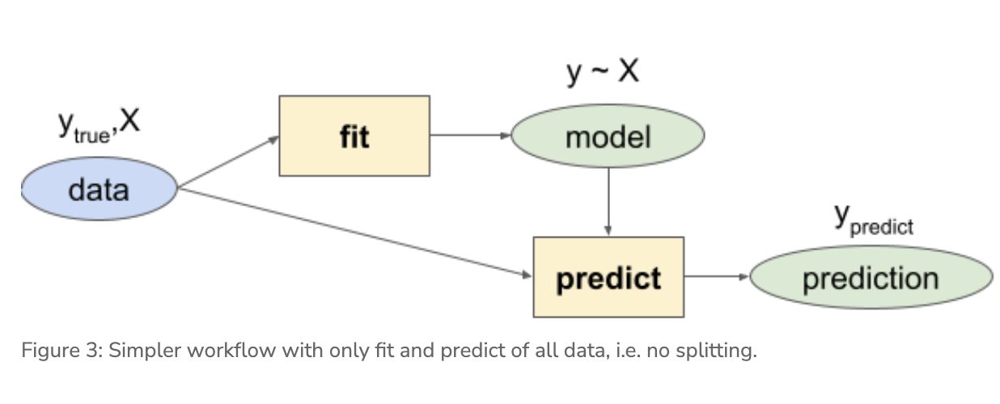

```{r setup, include=FALSE}
knitr::opts_chunk$set(echo = TRUE)
```

## Lab 1b. Species Distribution Modeling - Logistic Regression

### Learning Objectives

#### Exploratory Data Analysis (cont’d):

- Pairs plot to show correlation between variables and avoid multicollinearity (see 8.2 Many predictors in a model)

#### Logistic Regression seen as an evolution of techniques

- Linear Model to show simplest multivariate regression, but predictions can be outside the binary values.
- Generalized Linear Model uses a logit transformation to constrain the outputs to being within two values.
- Generalized Additive Model allows for “wiggle” in predictor terms.
- Maxent (Maximum Entropy) is a presence-only modeling technique that allows for a more complex set of shapes between predictor and response.

### Explore (continued)

Let’s load R packages and data from previous Explore session last time for your species.

```{r}
librarian::shelf(
  DT, dplyr, dismo, GGally, here, readr, tidyr)
select <- dplyr::select # overwrite raster::select
options(readr.show_col_types = F)

dir_data    <- here("ferret_data/sdm")
pts_env_csv <- file.path(dir_data, "pts_env.csv")

# pts_env_csv is a dataframe of all the pseudo absence points that we created in the last lab 1a

pts_env <- read_csv(pts_env_csv)
nrow(pts_env)
# number of points is 298, half real obs and half pseudo obs
```

```{r}
datatable(pts_env, rownames = F)
```


Let’s look at a pairs plot (using `GGally::ggpairs()`) to show correlations between variables.

```{r}
GGally::ggpairs(
  select(pts_env, -ID),
  aes(color = factor(present)))
```


## Section 2: Logistic Regression

We’ll work up to the modeling workflow using multiple regression methods along the way.


### 2.1: Setup Data

Let’s setup a data frame with only the data we want to model by:

- Dropping rows with any NAs. Later we’ll learn how to “impute” values with guesses so as to not throw away data.
- Removing terms we don’t want to model. We can then use a simplified formula present∼. to predict present based on all other fields in the data frame (i.e. the X`s in y∼x1+x2+...xn).

```{r}
# setup model data
d <- pts_env %>% 
  select(-ID) %>%  # remove terms we don't want to model
  tidyr::drop_na() # drop the rows with NA values
nrow(d)
```

### 2.2: Linear Model

Let’s start as simply as possible with a linear model lm() on multiple predictors X to predict presence y using a simpler workflow.



```{r}
# fit a linear model
mdl <- lm(present ~ ., data = d)
summary(mdl)
```

```{r}
y_predict <- predict(mdl, d, type="response")
y_true    <- d$present

range(y_predict)
```

```{r}
range(y_true)
```

The problem with these predictions is that it ranges outside the possible values of present 1 and absent 0. (Later we’ll deal with converting values within this range to either 1 or 0 by applying a cutoff value; i.e. any values > 0.5 become 1 and below become 0.)

### 2.3 Generalized Linear Model

To solve this problem of constraining the response term to being between the two possible values, i.e. the probability p of being one or the other possible y values, we’ll apply the logistic transformation on the response term.

logit(pi)=loge(pi1−pi)

We can expand the expansion of the predicted term, i.e. the probability p of being either y, with all possible predictors X whereby each coeefficient b gets multiplied by the value of x:

loge(pi1−pi)=b0+b1x1,i+b2x2,i+⋯+bkxk,i

```{r}
# fit a generalized linear model with a binomial logit link function
mdl <- glm(present ~ ., family = binomial(link="logit"), data = d)
summary(mdl)
```

```{r}
y_predict <- predict(mdl, d, type="response")

range(y_predict)
```

Excellent, our response is now constrained between 0 and 1. Next, let’s look at the term plots to see the relationship between predictor and response.

```{r}
# show term plots
termplot(mdl, partial.resid = TRUE, se = TRUE, main = F, ylim="free")
```
## Generalized Additive Model

With a generalized additive model we can add “wiggle” to the relationship between predictor and response by introducing smooth s() terms.

```{r}
librarian::shelf(mgcv)

# my variables: "WC_alt", "WC_bio1", "WC_bio4", "WC_bio12", "ER_minTempWarmest"

# fit a generalized additive model with smooth predictors
mdl <- mgcv::gam(
  formula = present ~ s(WC_alt) + s(WC_bio1) + 
    s(WC_bio4) + s(WC_bio12) + s(ER_minTempWarmest) + s(lon) + s(lat), 
  family = binomial, data = d)
summary(mdl)
```

```{r}
# show term plots
plot(mdl, scale=0)
```

## 2.5 Maxent (Maximum Entropy)

Maxent is probably the most commonly used species distribution model (Elith 2011) since it performs well with few input data points, only requires presence points (and samples background for comparison) and is easy to use with a Java graphical user interface (GUI).

```{r}
# load extra packages
librarian::shelf(
  maptools, sf)

mdl_maxent_rds <- file.path(dir_data, "mdl_maxent.rds")

# show version of maxent
if (!interactive())
  maxent()
```

This is MaxEnt version 3.4.3

```{r}
# get environmental rasters
# NOTE: the first part of Lab 1. SDM - Explore got updated to write this clipped environmental raster stack
env_stack_grd <- file.path(dir_data, "env_stack.grd")
env_stack <- stack(env_stack_grd)
plot(env_stack, nc=2)
```

```{r}
# get presence-only observation points (maxent extracts raster values for you)
obs_geo <- file.path(dir_data, "obs.geojson")
obs_sp <- read_sf(obs_geo) %>% 
  sf::as_Spatial() # maxent prefers sp::SpatialPoints over newer sf::sf class

# fit a maximum entropy model
if (!file.exists(mdl_maxent_rds)){
  mdl <- maxent(env_stack, obs_sp)
  readr::write_rds(mdl, mdl_maxent_rds)
}
mdl <- read_rds(mdl_maxent_rds)

# plot variable contributions per predictor
plot(mdl)
```

```{r}
# plot term plots
response(mdl)
```

```{r}
# predict
y_predict <- predict(env_stack, mdl) #, ext=ext, progress='')

plot(y_predict, main='Maxent, raw prediction')
data(wrld_simpl, package="maptools")
plot(wrld_simpl, add=TRUE, border='dark grey')
```

Notice how the plot() function produces different outputs depending on the class of the input object. You can view help for each of these with R Console commands: ?plot.lm, ?plot.gam and plot,DistModel,numeric-method.

Next time we’ll split the data into test and train data and evaluate model performance while learning about tree-based methods.


